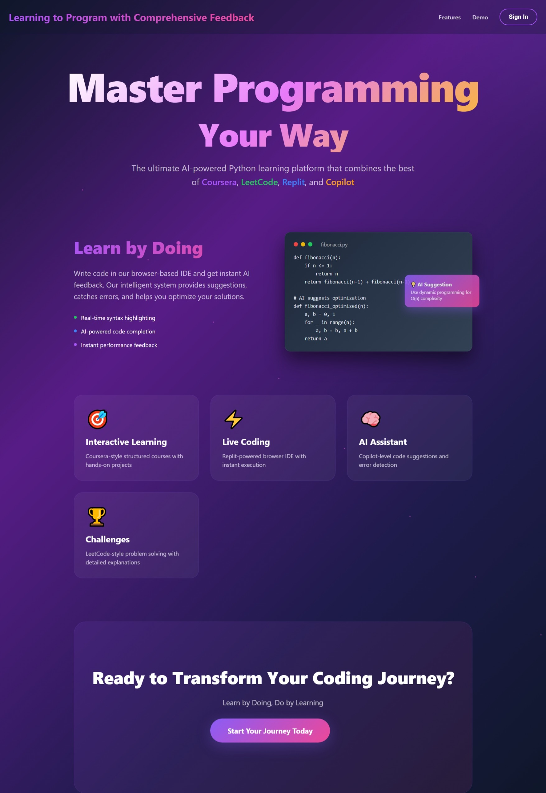
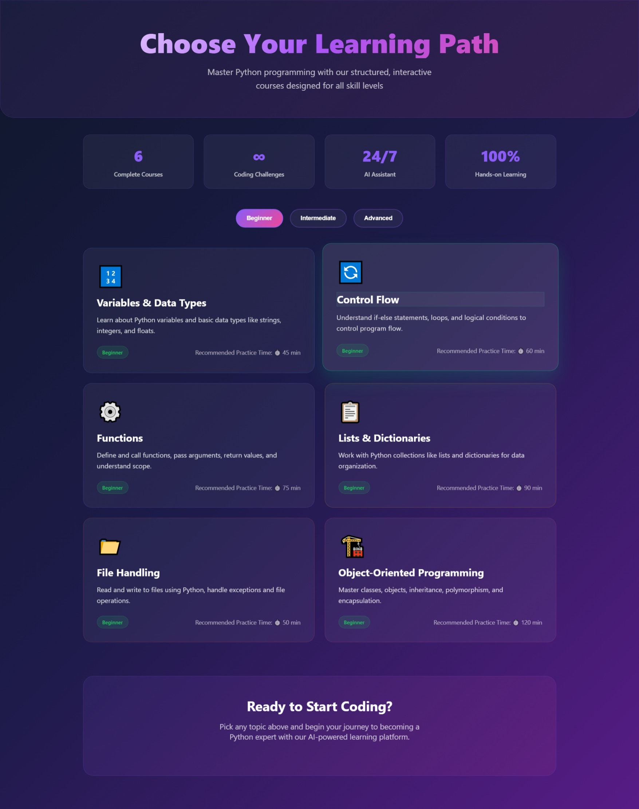
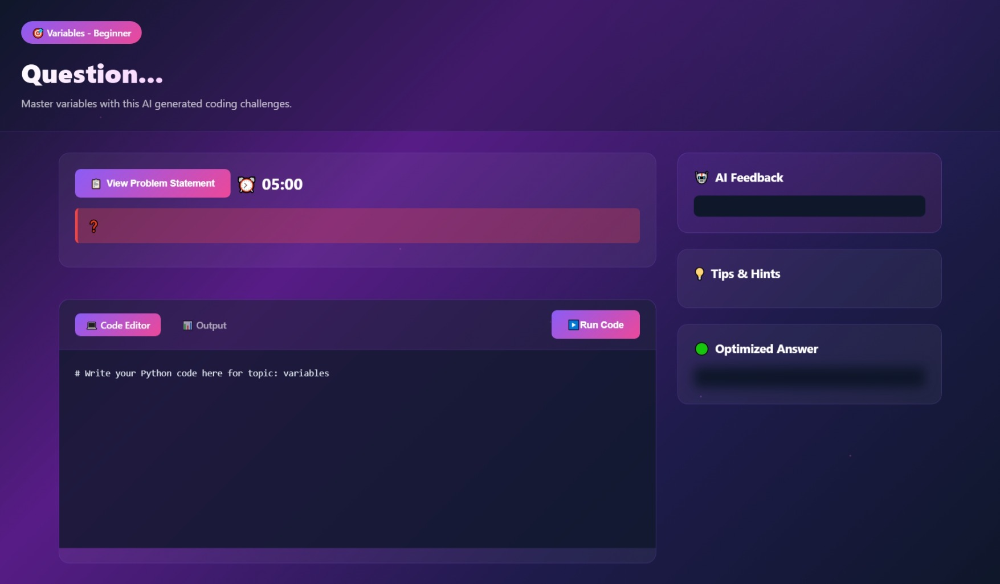
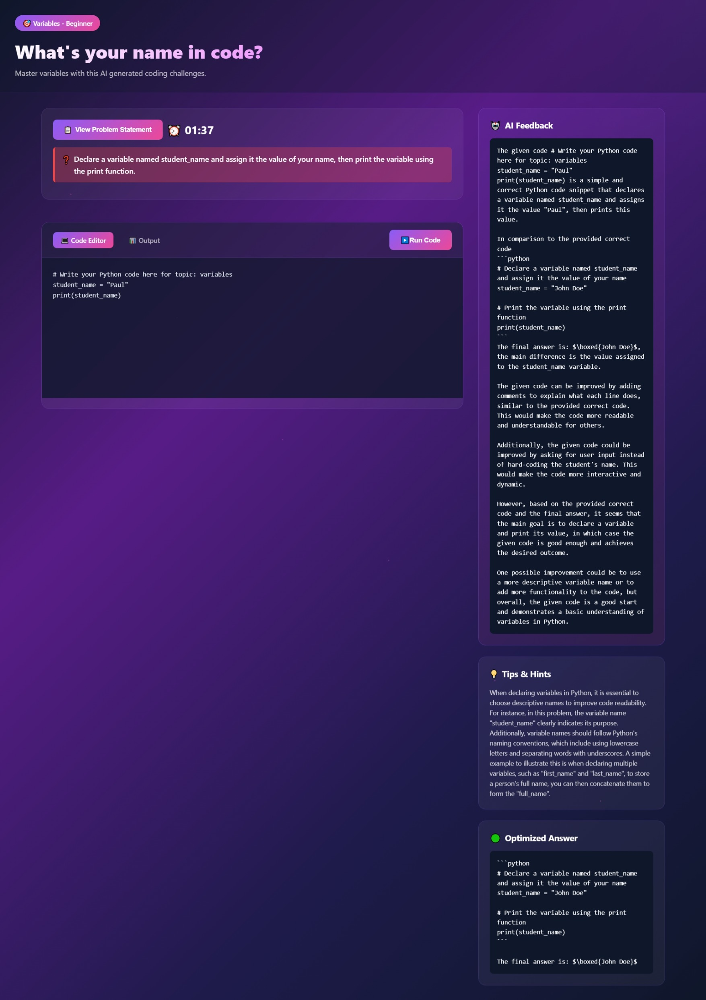
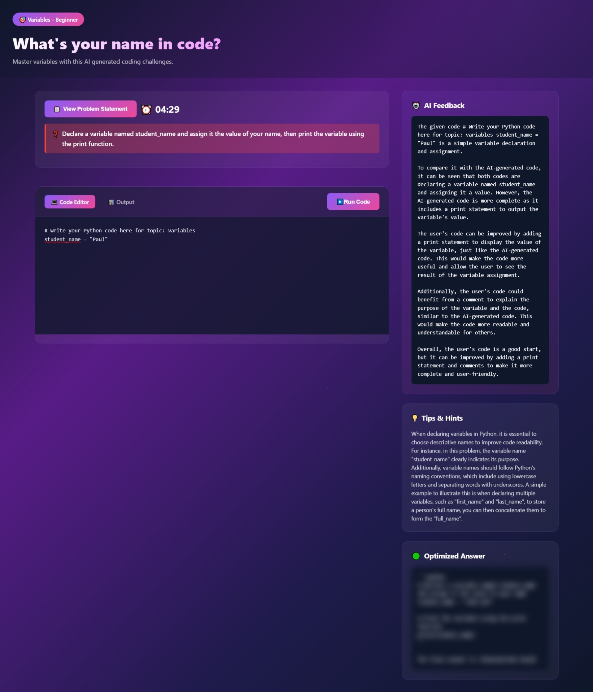
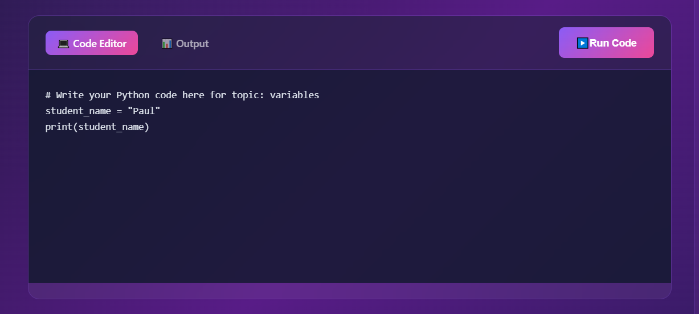
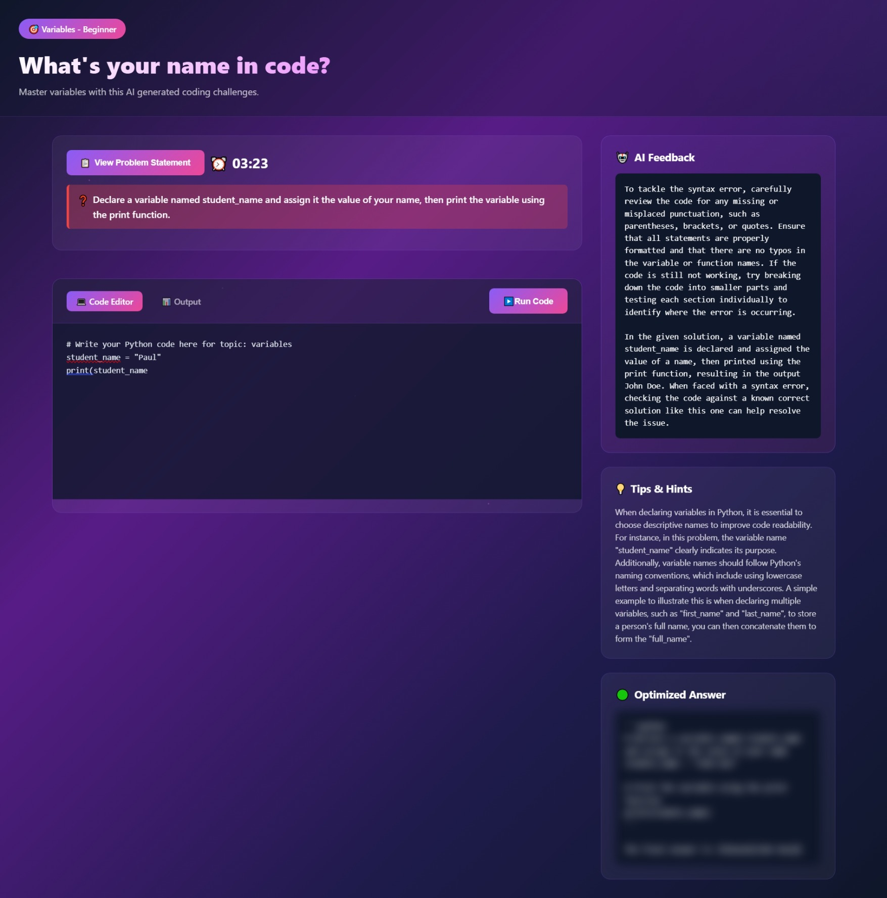

# Learning to Program with Comprehensive Feedback

## Overview

"Learning to Program with Comprehensive Feedback" is an interactive web-based platform designed to help beginners learn Python programming. The platform provides personalized, real-time feedback and guidance to users based on their performance. It integrates AI-driven tools to generate coding challenges, solutions, tips, and feedback to enhance the learning process.

## Features

* **Teaches Python**: Focuses on beginner-friendly Python programming with a hands-on approach.
* **Frontend and Backend**: Built using **React** for the frontend and **Flask** for the backend, ensuring a smooth and responsive user experience.
* **Pyodide**: Integrated with Pyodide to run Python code directly in the browser, eliminating the need for complex setups or installations.
* **Groq API**: Uses the **Groq** API to serve the **Llama 3 70B model**, enabling dynamic content generation for questions, answers, and feedback.
* **Dynamic Learning Experience**: The platform generates programming questions, answers, tips, and feedback based on the topic selected by the user.

## Pages

* **Landing Page**: The entry point to the platform with navigation to other sections.
* **Courses Page**: Provides an overview of available topics and allows users to select a topic to begin learning.
* **Problem Page**: Where learners interact with dynamically generated coding challenges. They can view questions, code solutions, and receive AI-generated feedback.

## Snapshots
* 
* Landing Page
* 
* Courses Page
* 
* Empty State Problem Page
* 
* Proper Feedback Capture
* 
* Room For Improvement
* 
* Output Section
* 
* Can Detect Error


## Technologies Used

* **React**: For building a fast and interactive user interface.
* **Flask**: For creating the backend API and handling data processing.
* **Pyodide**: To run Python code directly in the browser without the need for additional installations.
* **Groq**: Utilized for interacting with the **Llama 3 70B model** to generate personalized content such as questions, answers, tips, and feedback.

## How It Works

1. **Select a Topic**: The user selects a topic to start learning.
2. **Generate Question**: Based on the selected topic, a programming question is dynamically generated by the Llama 3 70B model.
3. **Receive Feedback**: After solving the problem, users can run their Python code, and the system provides real-time feedback and tips on improving their solution.
4. **Interactive Learning**: Learners can continue to improve their skills through continuous practice and feedback.

## Installation

To run this project locally, follow the steps below:

### Prerequisites

* Node.js and npm installed on your machine.
* Python and Flask installed for the backend.
* A Groq API key for accessing the Llama 3 70B model.

### Installation Steps

1. **Clone the repository**:

   ```bash
   git clone https://github.com/yourusername/learning-to-program.git
   ```

2. **Install Frontend Dependencies**:

   Navigate to the `frontend` folder and install the required dependencies:

   ```bash
   cd frontend
   npm install
   ```

3. **Install Backend Dependencies**:

   Navigate to the `backend` folder and install the required dependencies:

   ```bash
   cd backend
   pip install -r requirements.txt
   ```

4. **Set Up the Environment**:

   * Make sure to set up the necessary environment variables (like the Groq API key) in your `.env` files in both the frontend and backend folders.

5. **Run the Application**:

   * Start the backend server:

     ```bash
     cd backend
     python app.py
     ```

   * Start the frontend server:

     ```bash
     cd frontend
     npm start
     ```

6. **Open the application** in your browser at `http://localhost:3000`.

## Contributing

Feel free to open issues and submit pull requests. Contributions are welcome!

## License

This project is licensed under the MIT License.
